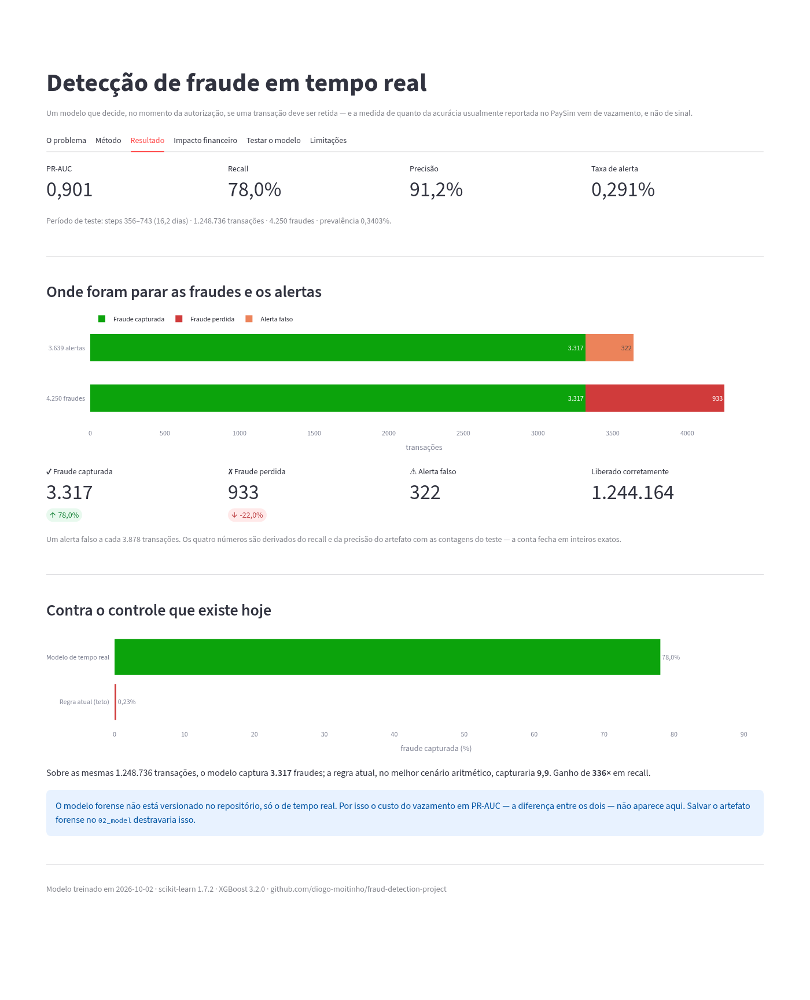
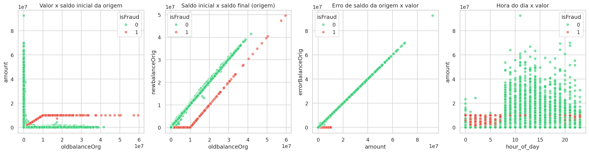
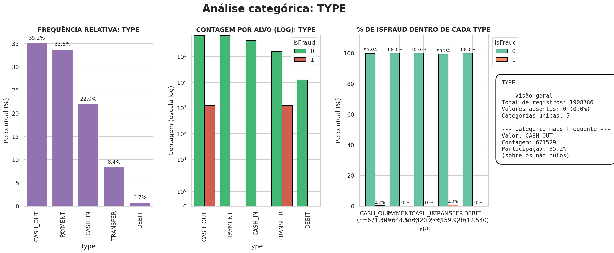
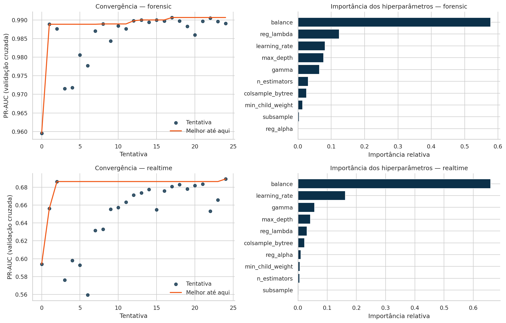
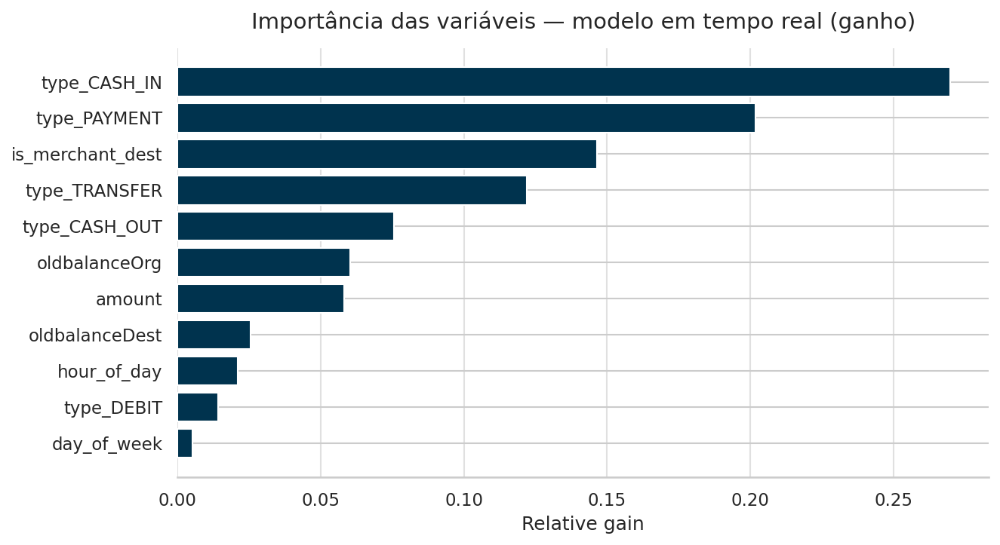
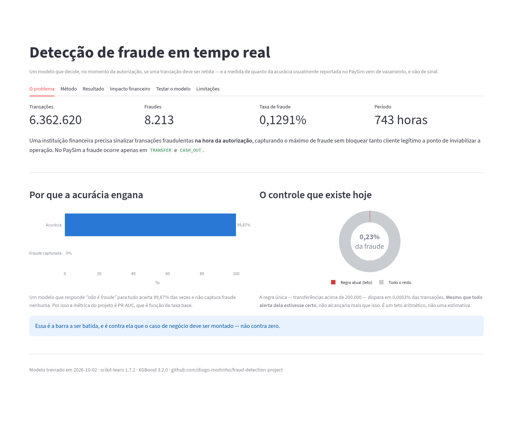
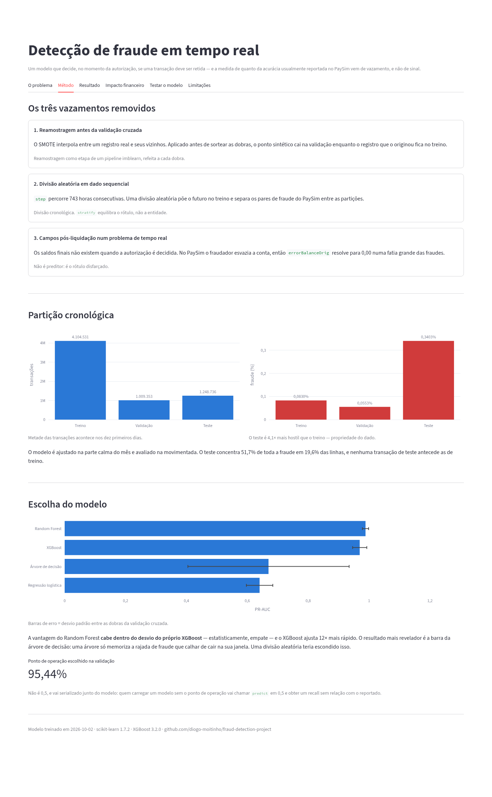
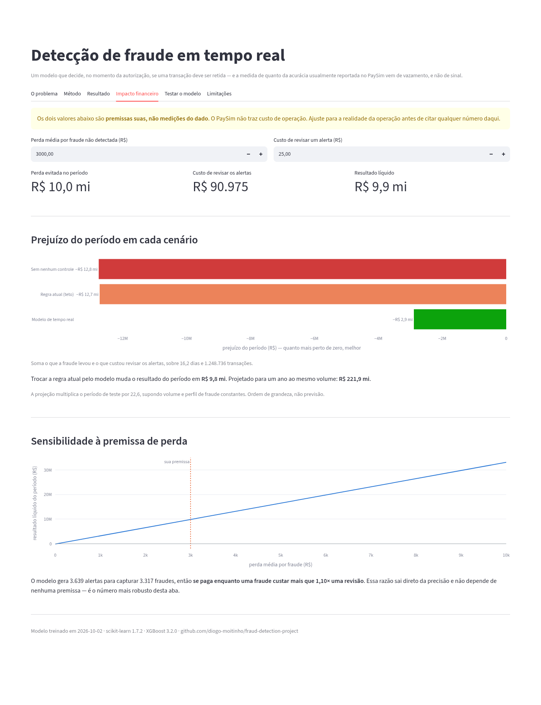
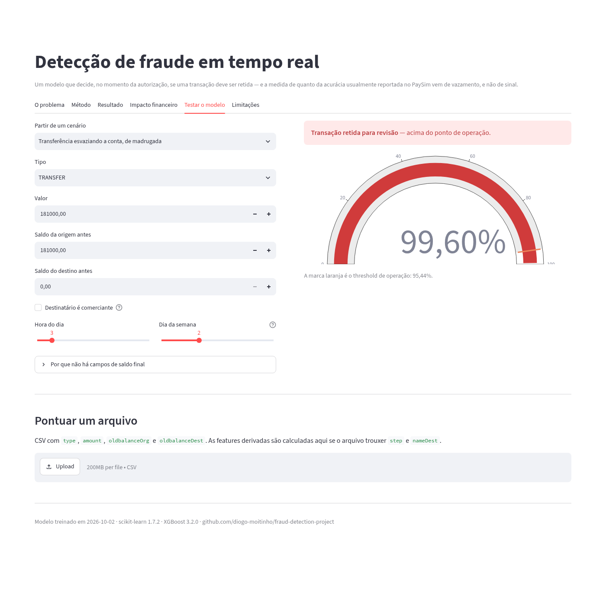

# Detecção de Fraude em Dados Transacionais

Detectando transações fraudulentas de mobile money no dataset PaySim — e medindo quanto
da acurácia normalmente reportada nesse dataset vem de vazamento de dados (data leakage),
e não de sinal real.


<p align="center">
  
</p>

## Resumo

### LINK STREAMLIT: https://fraud-detection-project-2fbuat3ekkges9bdwqjcnj.streamlit.app/


| | Tempo real (deployável) | Forense (pós-liquidação) |
|---|---|---|
| PR-AUC (teste) | **0,901** | 0,9995 |
| Recall | **78,0%** | 98,7% |
| Precisão | **91,2%** | 99,5% |
| Taxa de alerta | 0,291% | 0,338% |
| Fraudes capturadas / perdidas | 3.317 / 933 | 4.195 / 55 |
| Alertas falsos | 322 | 23 |
| Ganho de recall sobre a regra vigente | **336×** | — |

Avaliado no período de teste (steps 356–743, 1.248.736 transações, 4.250 fraudes), que o
modelo nunca viu nem no treino nem na escolha do threshold.

**Custo do vazamento: 0,099 de PR-AUC** — a diferença entre as duas colunas, atribuível
inteiramente a quatro colunas que não existem no momento da decisão. Na validação cruzada
a distância é ainda maior: 0,9907 contra 0,6893.

---

## O problema

Uma instituição financeira precisa sinalizar transações fraudulentas **no momento da
autorização**, capturando o máximo de fraude possível mantendo os falsos positivos baixos
o suficiente para não bloquear clientes legítimos.

O controle vigente é uma única regra: sinalizar transferências acima de 200.000. Ela
dispara em `0,000003` das transações contra uma taxa real de fraude de `0,001291`, então
mesmo que todos os seus alertas estivessem corretos ela não conseguiria capturar mais que
**0,23%** da fraude. Essa é a barra a ser batida, e é o número contra o qual o caso de
negócio deve ser montado — não contra zero.

## Por que este repositório não é só mais um notebook do PaySim

A maioria dos trabalhos publicados sobre esse dataset reporta ROC-AUC acima de 0,99. Este
projeto reproduz esse número, mostra que ele é em grande parte um artefato de três erros de
modelagem, e reporta o que sobra depois de removê-los.

**1. Reamostragem ajustada antes da validação cruzada.** O SMOTE interpola entre um
registro real e seus vizinhos mais próximos. Aplicado ao dataset antes de sortear as
dobras, um ponto sintético cai na dobra de validação enquanto o registro que o originou
permanece no treino — o modelo é testado em reconhecer uma combinação linear de linhas que
já memorizou. Aqui, a reamostragem é uma etapa dentro de um pipeline `imblearn`, reajustada
a cada dobra.

**2. Divisões aleatórias em dado sequencial.** A coluna `step` percorre 743 horas
consecutivas. Uma divisão aleatória coloca o futuro no treino. Ela também separa os pares
de fraude do PaySim — uma `TRANSFER` que esvazia uma conta comprometida seguida de um
`CASH_OUT` do mesmo valor — entre partições diferentes, deixando o modelo reconhecer um
valor que já viu antes. `stratify` não evita isso: ele equilibra o rótulo, não a entidade.
Aqui a divisão é cronológica.

**3. Campos pós-liquidação num problema de tempo real.** `newbalanceOrig`,
`newbalanceDest` e as colunas de erro de saldo derivadas delas não existem no momento em
que a decisão de autorização é tomada. No PaySim, um agente fraudador esvazia a conta, então
`amount` se iguala a `oldbalanceOrg` e `newbalanceOrig` colapsa para zero — o que faz
`errorBalanceOrig` resolver para exatamente 0,00 numa fatia grande das fraudes. Não é um
preditor, é o rótulo disfarçado.

O vazamento aparece a olho nu nos gráficos de dispersão da EDA. No segundo e no terceiro
painéis, as fraudes (em vermelho) formam linhas separadas das legítimas justamente nos
campos de saldo final:



Por isso o projeto treina **dois modelos**: um modelo de *tempo real*, restrito aos campos
disponíveis no momento da autorização, e um modelo *forense*, que mantém as colunas
pós-liquidação e só é válido para uma fila de revisão pós-liquidação. A diferença entre os
dois é reportada como o custo medido do vazamento.

## Dados

| | |
|---|---|
| Fonte | [PaySim, dataset sintético de mobile money](https://www.kaggle.com/datasets/ealaxi/paysim1) |
| Linhas | 6.362.620 |
| Taxa de fraude | 0,1291% (8.213 casos) |
| Período | 743 horas simuladas (~31 dias) |
| Canais com fraude | somente `TRANSFER` e `CASH_OUT` — `PAYMENT`, `CASH_IN` e `DEBIT` não têm nenhuma fraude registrada |



O CSV não é versionado. Baixe-o do Kaggle e coloque-o em `data/Fraud.csv` (caminho
configurado em `src/fraud_detection/config.py`).

## Método

**Particionamento.** Cronológico, por `step`, nos quantis 0,80 e 0,80 ponderados pela
contagem de linhas. Como o volume é concentrado no início — metade de todas as transações
cai nos dez primeiros dias — o corte fica perto do dia 13, não do dia 25.

| Partição | Steps | Dias | Linhas | Fraudes | Taxa |
|---|---|---|---|---|---|
| TREINO | 1–301 | 1–13 | 4.104.531 | 3.405 | 0,0830% |
| VALIDAÇÃO | 302–355 | 13–15 | 1.009.353 | 558 | 0,0553% |
| TESTE | 356–743 | 15–31 | 1.248.736 | 4.250 | 0,3403% |

O período de teste é **4,1× mais hostil** que o período de treino, e concentra 51,7% de
toda a fraude em 19,6% das linhas. Isso é uma propriedade do dado, não um defeito de
amostragem: o modelo é ajustado na parte calma do mês e avaliado na movimentada. A
prevalência é reportada por partição porque o PR-AUC é função da taxa base.

**Métrica.** `average_precision` — área sob a curva Precisão-Recall. Com uma taxa base de
0,13%, prever "não é fraude" para tudo dá 99,87% de acurácia, e o ROC-AUC continua
enganosamente alto porque a taxa de falsos positivos quase não se move quando os negativos
superam os positivos em três ordens de grandeza.

**Validação.** `TimeSeriesSplit` em cadeia progressiva, de forma que toda dobra de
validação é estritamente posterior às suas dobras de treino. O tuning roda sobre uma
subamostra estratificada do TREINO (615.680 linhas, 511 fraudes) que preserva prevalência e
ordem temporal.

**Tuning.** Optuna TPE, 25 tentativas, um estudo independente por conjunto de features,
porque hiperparâmetros selecionados na matriz forense de 11 colunas não se transferem bem
para a matriz de tempo real de 7 colunas. A estratégia de balanceamento de classes — SMOTE
versus `scale_pos_weight` — é ela mesma um parâmetro ajustado, não uma suposição; nos dois
estudos venceu `scale_pos_weight`, e é de longe o hiperparâmetro mais importante.



**Comparação de modelos.** Três famílias, cada uma com seu próprio estudo do Optuna, sob a
mesma validação cruzada (PR-AUC médio nas dobras):

| Modelo | Forense | Tempo real |
|---|---|---|
| XGBoost | 0,9907 | **0,6893** |
| Random Forest | **0,9938** | 0,6724 |
| Regressão Logística | 0,6336 | 0,1403 |

Random Forest e XGBoost empatam na prática; o XGBoost foi o escolhido por liderar no
conjunto de tempo real — o único que pode ir para produção — e por ajustar bem mais rápido.
A regressão logística desaba no tempo real: sem os saldos finais, a fronteira de decisão
deixa de ser aproximadamente linear.

**Threshold.** Selecionado na partição de validação, nunca no teste, e serializado junto
com o modelo (`0,9544` no de tempo real). Um modelo salvo sem seu ponto de operação não é
utilizável: quem o carregar vai chamar `predict` em 0,5 e obter um recall sem relação com o
reportado.

## Resultados

Os números da tabela do [Resumo](#resumo) saem de `mdl.evaluate_feature_sets` em
`02_model.ipynb`. O que o modelo de tempo real aprendeu:



O tipo de transação domina: `CASH_IN` e `PAYMENT` têm alto ganho porque permitem descartar
de imediato canais onde a fraude nunca acontece. Destinatário comerciante cumpre papel
parecido. Entre as variáveis contínuas, o saldo da origem antes da transação e o valor
carregam o sinal do padrão "esvaziar a conta" — sem precisar do saldo final.

## Painel Streamlit

[streamlit/streamlit_app.py](streamlit/streamlit_app.py) é um painel interativo construído
sobre o artefato `notebooks/models/fraud_realtime_v1.joblib` — nada é retreinado nele.

| Aba | Conteúdo |
|---|---|
| O problema | volume, taxa de fraude e o teto aritmético do controle vigente |
| Método | os três vazamentos corrigidos, a partição cronológica, a escolha do modelo |
| Resultado | PR-AUC, recall e precisão do teste, para onde foram fraudes e alertas |
| Impacto financeiro | simulador com premissas de custo ajustáveis pelo usuário |
| Testar o modelo | pontua um cenário manual ou um CSV carregado, com gauge de probabilidade |
| Limitações | as mesmas ressalvas deste README, em formato de painel |

<table>
  <tr>
    <td></td>
    <td></td>
  </tr>
  <tr>
    <td align="center"><b>O problema</b></td>
    <td align="center"><b>Método</b></td>
  </tr>
  <tr>
    <td></td>
    <td></td>
  </tr>
  <tr>
    <td align="center"><b>Impacto financeiro</b></td>
    <td align="center"><b>Testar o modelo</b></td>
  </tr>
</table>

Para rodar:

```bash
pip install -r requirements.txt
streamlit run streamlit/streamlit_app.py
```

O app sobe a árvore de diretórios a partir de `streamlit_app.py` até achar o `.joblib`, então
funciona rodado de qualquer lugar dentro do repositório. Suas dependências são as mínimas
para servir o artefato — ver os comentários em `requirements.txt` sobre por que `polars`,
`optuna` e `seaborn` (usados só nos notebooks) ficam de fora. `scikit-learn` e `xgboost`
estão fixados nas versões com que o artefato foi salvo.

## Estrutura do repositório

```
.
├── notebooks/
│   ├── 01_eda.ipynb            fases 1–4: definição do problema, entendimento dos dados, EDA
│   ├── 02_model.ipynb          fases 5–9: pré-processamento, tuning, avaliação, deploy
│   ├── models/                  artefato serializado do modelo de tempo real
│   ├── images/                  gráficos exportados e capturas do painel
│   └── figuras/                 gráficos do tuning
├── src/fraud_detection/
│   ├── config.py                caminhos, seed, geometria dos splits, contratos de features
│   ├── preprocessing.py         carga, engenharia de features, splits, pipelines
│   ├── model.py                 CV, Optuna, avaliação, importâncias
│   ├── reporting.py             gráficos da etapa de modelagem e narrativa gerada
│   ├── deployment.py            persistência de artefato e ponto de entrada de scoring
│   ├── visualizer.py            painéis da EDA e exportação de figuras
├── streamlit/
│   └── streamlit_app.py         painel interativo sobre o artefato de tempo real
└── data/                        CSV bruto (gitignored)
```

Os notebooks **não contêm definições de função**. Todo comportamento reutilizável vive no
pacote, então os notebooks funcionam como narrativa e a lógica fica testável, diffável e
importável fora do Jupyter.

Os gráficos são exportados com `visualizer.salvar_figura` (ou `rpt.salvar_figura`) antes do
`plt.show()`, e as funções de painel aceitam `salvar=True`. As imagens caem em
`notebooks/images/` (`config.IMAGES_DIR`) e são as mesmas referenciadas neste README.

## Reproduzindo

```bash
python -m venv .venv && source .venv/bin/activate
pip install -r requirements.txt
pip install polars optuna seaborn ipywidgets jupyterlab
pip install -e .                 # instala o pacote fraud_detection a partir de src/

# coloque o Fraud.csv em data/, então:
jupyter lab
```

Rode `01_eda.ipynb` do início ao fim, depois `02_model.ipynb`. Reserve tempo para o
notebook de modelagem: os estudos do Optuna (XGBoost, Random Forest e Regressão Logística,
nos dois conjuntos de features) são a maior parte dele. `Restart & Run All` é o ponto de
entrada pretendido, e regrava o artefato usado pelo painel.

## Limitações

- **Dado sintético.** Os agentes de fraude do PaySim seguem regras programadas, aprendíveis
  de um jeito que adversários reais não são. Toda métrica aqui é um limite superior do
  desempenho no mundo real.
- **Sem deriva adversarial.** Validado em um mês de uma simulação estática. Padrões reais de
  fraude mudam em resposta à detecção, então o desempenho em produção decai sem retreino.
- **Escopo de transação única.** Cada transação é pontuada isoladamente. O modelo não
  enxerga que uma conta recebeu três transferências nos dez minutos anteriores, que é como
  quadrilhas de fraude de fato aparecem. Agregados de velocidade por conta sobre uma janela
  móvel de `step` são a extensão de maior valor disponível, e a razão pela qual a busca de
  hiperparâmetros estabiliza cedo — a restrição é o conjunto de features, não o modelo.
- **Suposição de custo simétrico.** O threshold padrão maximiza F1, o que precifica um
  cliente legítimo bloqueado e uma fraude perdida como se fossem a mesma coisa. Não são.
  `model.threshold_for_cost_ratio` aceita uma razão explícita assim que o negócio fornecer
  uma.

## Próximos passos

1. Agregados de velocidade por conta sobre uma janela móvel de `step`, computados
   estritamente a partir de linhas passadas para preservar a ordem causal.
2. Rederivar o ponto de operação contra custos explícitos de falso positivo e falso
   negativo.
3. Linha de base de monitoramento sobre a distribuição das predições e a taxa de alerta,
   para capturar deriva antes que o recall degrade silenciosamente.
4. Validação contra dado transacional real antes de qualquer consideração de produção.
5. Salvar também o artefato forense, para o painel exibir o custo do vazamento lado a lado.
